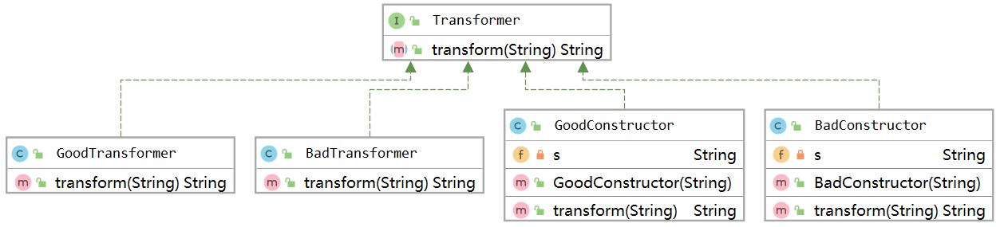
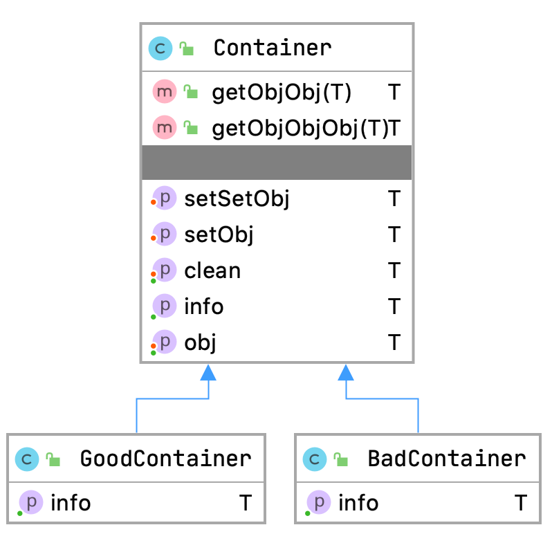
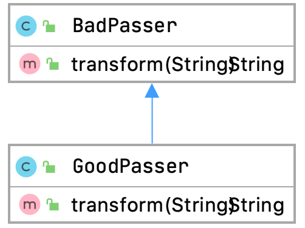
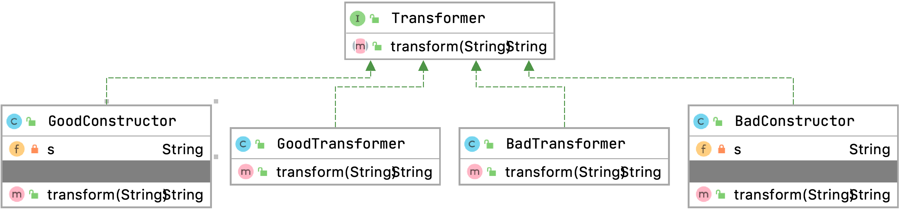

# Intro
taintbenchmark用于评估污点分析扫描器引擎的能力。

白盒扫描器的普遍使用污点分析技术，那么有两方面影响这扫描器的准确性：扫描器引擎本身（如是否支持准确的过程间分析）和规则完备性（如source、sink配置是否充分）；

在相同benchmark上使用不同规则比较不同扫描器是无意义的。

# 辅助类

## Transformer

* [I] Transformer：Transformer接口实现`String transform(String from)`方法；
* [C] GoodTransformer：transform方法返回固定字符串（不传播污点）；
* [C] BadTransformer：transform方法返回原字符串（传播污点）；
* [C] GoodConstructor：transform方法返回固定字符串，但其属性s保存有污点（不传播污点）；
* [C] GoodConstructor：transform方法返回属性s，其属性s保存有污点（传播污点）；

## Container

Container包含容器（污染）字段obj和安全字段clean，有setObj()和setSetObj()方法设置obj，有getObjObj()，getObjObjObj()方法获取obj，GoodContainer和BadContainer继承Container，区别在于GoodContainer获取info为安全字段，Bad获取obj。

## Passer

BadPasser和GoodPasser都实现transform方法，区别在于其返回/不返回污点。

## Transformer

* Transformer接口提供transform()方法；
* BadTransformer和GoodTransformer实现该接口，GoodTransformer在方法中清洁污点；
* BadConstructor和GoodConstructor实现该接口，在transform时返回s，GoodConstructor在初始化时清洁s。

# 测试套件

## 过程内分析（top.anemone.taintbenchmark.intraprocedural.*）

（这里只测试最简单的过程内分析，各类敏感情况由其他测试套件测试）

* IntraBad1：从用户输入读取source，返回到页面上，存在XSS漏洞；
* IntraGood1：从用户输入读取source，随后source被赋值为安全数据，返回到页面上，不存在XSS漏洞；
* IntraBad2：从用户输入读取source，经过append()，replace()，返回到页面上，存在XSS漏洞；

## 过程间分析（top.anemone.taintbenchmark.interprocedural.*）

* PrivateBad1：source通过私有函数bad()函数传递，在sink点调用；
* PrivateGood1：source通过私有函数good()函数清除污点，在sink点调用；
* StaticBad1：source通过静态函数bad()函数传递，在sink点调用；
* StaticGood1：source通过静态函数good()函数清除污点，在sink点调用；
* AbstractBad1/AbstractGood1：初始化BadPasser/GoodPasser传递污点，在sink点调用；
* ConstructBad1/ConstructGood1：初始化BadConstructor/GoodConstructor传递污点，在sink点调用；
* InterfaceBad1/InterfaceGood1：初始化BadTransformer/GoodTransformer传递污点，在sink点调用；
* InterfaceBad2/InterfaceGood2：构造匿名transformer，匿名transformer传递/不传递污点，在sink点调用；
* PointerBad1：构造Container c且c.obj->"clean"，构造Container fakeGood且fakeGood.obj->c，构造Container bad且bad.obj->c，将bad.obj.obj->source，并在sink点取fakeGood.obj.obj；
* PointerGood1：构造Container c且c.obj->source；构造Container good，good.obj->c；构造Container bad，bad.obj->c；将good.obj.obj->"clean"，并在sink点取bad.obj.obj；

## 域敏感(top.anemone.taintbenchmark.fieldsensitive.*)

* FieldBad1/FieldGood1：污点和安全数据分别存在container的obj和clean字段（set写入），在sink点取出obj/clean；
* FieldBad2/FieldGood2：污点和安全数据分别存在container的obj和clean字段（构造函数写入），在sink点取出obj/clean；
* FieldBad3/FieldGood3：污点和安全数据分别存在container的obj和clean字段，container位于类的私有变量，在sink点取出obj/clean；

## 上下文敏感(top.anemone.taintbenchmark.contextsensitive.*)

* ContextBad1/ContextGood1：同时初始化BadTransformer和GoodTransformer，并经过`id()`函数返回，在sink点调用`BadTransformer/GoodTransformer.transform(source)`，因此存在/不存在漏洞；
* ContextBad2/ContextGood2：BadTransformer和GoodTransformer 经过Container包装后返回，获取Bad/GoodTransformer的结果，因此存在/不存在漏洞，与ContextBad/Good1不同的是该用例检测1-object sensitive；
* ContextBad3/ContextGood3：类似ContextBad/Good2，与ContextBad2不同是的是setObj()进行了1次封装，用于检测2-CFA；
* ContextBad4/ContextGood4：类似ContextBad/Good2，，与ContextBad2不同是的是setObj()进行了2次封装，用于检测3-CFA；
* ContextBad5/ContextGood5：类似ContextBad/Good2，，与ContextBad2不同是的是getObj()中新建了Container，用于检测2-object sensitive；
* ContextBad6/ContextGood6：类似ContextBad/Good2，，与ContextBad2不同是的是getObjObj()中新建了两次Container，用于检测3-object sensitive；
* HeapBad1/HeapGood1：BadTransformer和GoodTransformer经过newContainer()包装后返回，获取Bad/GoodTransformer的结果，因此存在/不存在漏洞，检测Heap sensitive；

## 流敏感(top.anemone.taintbenchmark.flowsensitive.*)

* FlowBad1：三目操作符，污点有可能传递，因此存在漏洞；
* FlowBad2：if判断，污点有可能传递，因此存在漏洞；
* FlowBad3：while循环，污点传递，因此存在漏洞；
* FlowBad4：for循环，污点传递，因此存在漏洞；
* FlowBad5：source和清洁变量不交换，因此存在漏洞；
* FlowBad6：循环清除污点，但终结时污点传递，因此存在漏洞；
* FlowGood6：循环传递污点，但终结时清楚污点，因此存在漏洞；
* FlowGood5：source和清洁变量交换，因此不存在漏洞；
* FlowFieldBad4_1：source通过构造函数传入container的obj字段，再被sink调用，在调用后被清洁；
* FlowFieldGood4_1：安全数据通过构造函数传入container的obj字段后被set()清除，再被sink调用，在调用后被污染；
* FlowFieldBad4_2：source通过set()传入container的obj字段，再被sink调用，在调用后被清洁；
* FlowFieldGood4_2：安全数据通过set()传入container的obj字段，再被sink调用，在调用后被污染；
* FlowFieldBad5：当 a!=32 时取BadContainer，否则取GoodContainer，再从Container.getInfo()中获取污点/安全数据；
* FlowFieldGood5：当 a==32 时取BadContainer，否则取GoodContainer，再从Container.getInfo()中获取污点/安全数据；
* FlowFieldBad6：`outerContainer->badc; innerContainer->bad;outerContainer.obj->inner`，接着设置inner的obj为source，最后在sink获取badc.obj.obj(source)；
* FlowFieldBad7：初始化装载source和安全数据的container，假交换，在sink点获取抓那个在source的container；
* FlowFieldGood7：初始化装载source和安全数据的container，之后交换，在sink点获取安全数据container；
* FactoryBad1: 通过工厂方法获取BadTransformer，传递污点；
* FactoryGood1: 通过工厂方法获取GoodTransformer，不传递污点；

## 容器类型(top.anemone.taintbenchmark.container.*)

* ListBad1/ListGood1：污点存储在列表的第0个元素中，sink点取出第0/1个元素，因此存在/不存在漏洞；
* MapBad1/MapGood1：污点存储在map的"source"键中，sink点取出"source"/"boo"键，因此存在/不存在漏洞；
* MapBad2/MapGood2：污点存储在map的"source"键中，sink点取出"source"/"boo"键，因此存在/不存在漏洞，与MapBad1/MapGood1不同的是"source"键保存在变量中（`String s="source";map.put(s,taint)`）

## 隐藏信道(top.anemone.taintbenchmark.convertchannel.*)

* ExceptionBad1：返回异常信息，由于异常信息中存在用户可控内容，因此存在漏洞；
* ExceptionBad2/ExceptionGood2：返回自定义异常信息，由于异常信息中存在用户可控内容，因此存在漏洞；
* ExceptionBad3：在catch处命中sink点，存在漏洞；
* ExceptionGood3：在finally处清洁污点，不存在漏洞；
* IfBad1/IfGood1：在if判断时对比输入是/否为"helloworld"，若是/否，将其赋值为"helloworld"，若能被成功赋值则不含漏洞；

## Soundiness
### Reflect（top.anemone.taintbenchmark.soundiness.reflect.*）
* ReflectBad1/ReflectGood1：构造BadTransformer/GoodTransformer，使用反射调用其transform方法，传入sink；
* ReflectBad2/ReflectGood2：反射获取BadTransformer/GoodTransformer，使用反射调用其transform方法，传入sink；

## 跨应用（top.anemone.taintbenchmark.differentscope.thirdpartpkg.*）
* CommonPassBad1：污点通过org.apache.commons.exec.util.StringUtils#fixFileSeparatorChar()传递至sink；
* CommonSinkBad1：污点通过org.apache.commons.exec.DefaultExecutor#execute(org.apache.commons.exec.CommandLine)执行；
* ExeBad1：构造BadExecutor（Executor在另一模块中），污点传入BadExecutor后传入Runtime.exec()；
* ExeGood1_1：构造GoodExecutor1，污点传入GoodExecutor1后在exe()中净化，不会传入Runtime.exec()；
* ExeGood1_2：构造GoodExecutor2，污点传入GoodExecutor2后在getcmd()中被净化；
* ExeBad2/ExeGood2：构造GoodExecutor2/GoodExecutor1为executor，构造ExeAgent2，将executor和污点传入Agent，Agent调用executor.exe()，造成/不造成漏洞；

# Source & Sink

本benchmark只会出现以下source&sink点：
## Source
* javax.servlet.ServletRequest#getParameter
## Sink
* java.io.PrintWriter#println(java.lang.String)
* org.apache.commons.exec.launcher.CommandLauncher#exec(org.apache.commons.exec.CommandLine, java.util.Map<java.lang.String,java.lang.String>, java.io.File)
* java.lang.Runtime#exec(java.lang.String)

# TODO

吸收DroidBench中Reflect和General Java部分

# Limitation

* 无法测试大规模程序
  * 一些扫描器对函数调用深度、域敏感、上下文敏感深度有限制，本benchmark无法测试
  * 对于大规模程序扫描时长本benchmark无法测试

# 相似项目

* https://github.com/secure-software-engineering/DroidBench: Android benchmark，本项目吸收了其中很多case，然而该项目是针对Android，有很多Android特性，相比而言本项目面向web，代码更加简单，在测试扫描器时建议结合droidbench(尤其是general java部分）。
